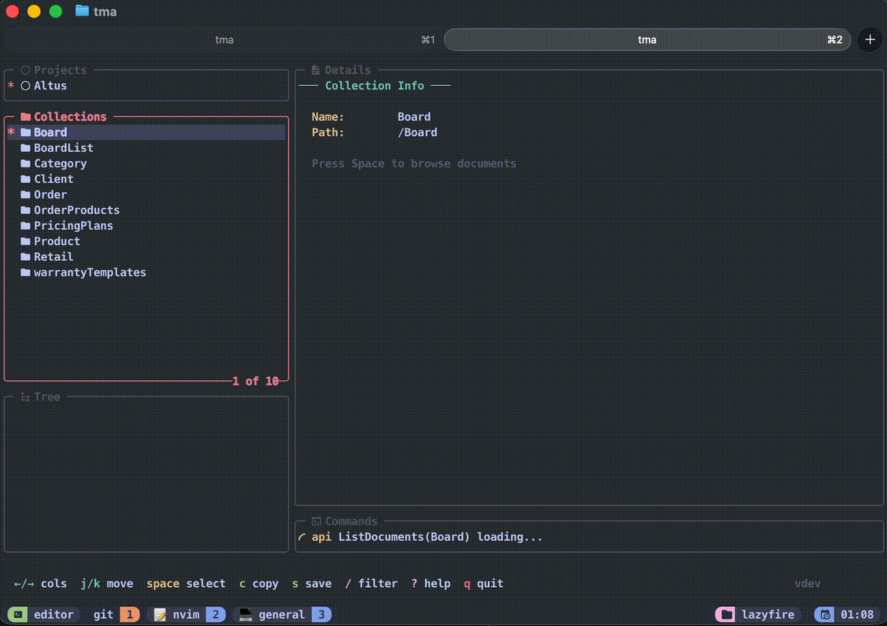

# 🔥 LazyFire

A terminal UI for browsing Firebase Firestore, inspired by [lazygit](https://github.com/jesseduffield/lazygit).


## Features

- Browse Firestore collections and documents
- Expandable tree view for nested subcollections
- View document data as syntax-highlighted JSON
- Filter/search across all panels
- **Query Builder** - Interactive Firestore query builder with WHERE, ORDER BY, LIMIT
- **jq query support** for filtering JSON in details panel
- **Visual select mode** for multi-document selection and parallel fetching
- **Smart caching** - Documents and collections cached with visual indicator
- **Document stats** with Firestore limits validation (size, fields, depth)
- Vim-style keybindings (h/j/k/l)
- Mouse support (click to select, navigate)
- Customizable theme (hex colors, 256-color, bold)
- Nerd Font icons (optional, with graceful fallback)
- Uses existing Firebase CLI authentication
- Dynamic panel sizing (focused panel expands)
- Copy/save document JSON to clipboard or file

## Installation

### Homebrew (macOS/Linux)

```bash
brew tap marjoballabani/tap
brew install lazyfire
```

### Using Go Install

```bash
go install github.com/marjoballabani/lazyfire@latest
```

### From Source

```bash
git clone https://github.com/marjoballabani/lazyfire.git
cd lazyfire
go build -o lazyfire .
```

### Download Binary

Download pre-built binaries from the [releases page](https://github.com/marjoballabani/lazyfire/releases).

## Quick Start

1. **Login to Firebase** (if not already):
   ```bash
   firebase login
   ```

2. **Run LazyFire:**
   ```bash
   lazyfire
   ```

3. **Navigate:** Use arrow keys or `h/j/k/l` to browse your Firestore data.

## Preview



**Panels:**
- **Projects** - Your Firebase projects
- **Collections** - Root collections in selected project
- **Tree** - Documents and subcollections (expandable)
- **Details** - Document JSON data with syntax highlighting
- **Commands** - API call status

## Keybindings

| Key | Action |
|-----|--------|
| `h` `←` | Move to left panel |
| `l` `→` | Move to right panel |
| `j` `↓` | Move down in list |
| `k` `↑` | Move up in list |
| `Tab` | Go to details panel |
| `Enter` | Open document in details / Fetch project info |
| `Space` | Select / Expand / Collapse (fetch selected in select mode) |
| `v` | Toggle select mode (tree panel) |
| `F` | Open query builder (collections/tree panel) |
| `/` | Filter current panel |
| `c` | Copy JSON to clipboard (respects jq filter) |
| `s` | Save JSON to ~/Downloads (respects jq filter) |
| `e` | Open in external editor (details panel) |
| `Esc` | Back: close popup / cancel filter / clear filter / exit select mode |
| `r` | Refresh |
| `?` | Show keyboard shortcuts |
| `@` | Show command history |
| `q` | Quit |

### Mouse

- **Click** on any panel to focus and select item
- **Click** outside popup to close it

## Filtering & jq Queries

Press `/` to filter any panel. In the **details panel**, you can use jq queries:

| Filter | Description |
|--------|-------------|
| `name` | Text search - shows lines containing "name" |
| `.name` | jq query - extracts the `name` field |
| `.users[0]` | jq query - first element of users array |
| `.data \| keys` | jq query - list keys of data object |

When a jq filter is active, `c` and `s` copy/save the filtered result instead of the full document.

## Query Builder

Press `F` (Shift+F) on a collection or subcollection to open the query builder:

```
┌─ Query Builder ─────────────────────────────┐
│ Collection: users                           │
│                                             │
│ WHERE:                                      │
│   [status] [==] (auto) [active]             │
│                                             │
│ ORDER BY:  [created] [DESC]                 │
│ LIMIT:     [50]                             │
│                                             │
│ [ Execute ]  [ Clear ]                      │
└─────────────────────────────────────────────┘
```

- **Navigate:** `j`/`k` to move between rows, `h`/`l` to move between fields
- **Edit:** `Enter` to edit a field, `a` to add filter, `d` to delete filter
- **Operators:** `==`, `!=`, `<`, `<=`, `>`, `>=`, `in`, `array-contains`
- **Execute:** Run query and show results in tree
- **Clear:** Reset all filters

Query results appear in the tree panel. For subcollection queries, results appear under the subcollection node.

## Configuration

Create `~/.lazyfire/config.yaml`:

```yaml
ui:
  # Icons: "3" (Nerd Fonts v3), "2" (v2), or "" (disable)
  nerdFontsVersion: "3"

  theme:
    activeBorderColor:
      - cyan
    inactiveBorderColor:
      - default
    optionsTextColor:
      - cyan
    selectedLineBgColor:
      - blue
```

### Icons

LazyFire uses [Nerd Fonts](https://www.nerdfonts.com/) icons by default. If icons don't display correctly:

```yaml
# Use Nerd Fonts v2 (older version)
ui:
  nerdFontsVersion: "2"

# Or disable icons entirely
ui:
  nerdFontsVersion: ""
```

### Color Options

- **Named colors:** `black`, `red`, `green`, `yellow`, `blue`, `magenta`, `cyan`, `white`, `default`
- **Hex colors:** `#ed8796`, `#ff79c6`
- **256-color:** `0` - `255`
- **Attributes:** `bold`, `underline`, `reverse`

### Example Themes

**Catppuccin Macchiato:**
```yaml
ui:
  theme:
    activeBorderColor: ["#ed8796", "bold"]
    inactiveBorderColor: ["#5f626b"]
    optionsTextColor: ["#8aadf4"]
    selectedLineBgColor: ["#494d64"]
```

**Dracula:**
```yaml
ui:
  theme:
    activeBorderColor: ["#ff79c6", "bold"]
    inactiveBorderColor: ["#6272a4"]
    optionsTextColor: ["#8be9fd"]
    selectedLineBgColor: ["#44475a"]
```

## Requirements

- Firebase CLI (`npm install -g firebase-tools`)
- Terminal with true color support (recommended)
- [Nerd Font](https://www.nerdfonts.com/) for icons (optional)
- Go 1.21+ (only if building from source)

## Contributing

Contributions welcome! Please open an issue or PR.

## Changelog

See [CHANGELOG.md](CHANGELOG.md) for a detailed list of changes.

## License

MIT - see [LICENSE](LICENSE)

Third-party licenses: [THIRD_PARTY_LICENSES](THIRD_PARTY_LICENSES)

## Acknowledgments

- [lazygit](https://github.com/jesseduffield/lazygit) - UI inspiration
- [gocui](https://github.com/jesseduffield/gocui) - Terminal UI library
- [gojq](https://github.com/itchyny/gojq) - Pure Go jq implementation
